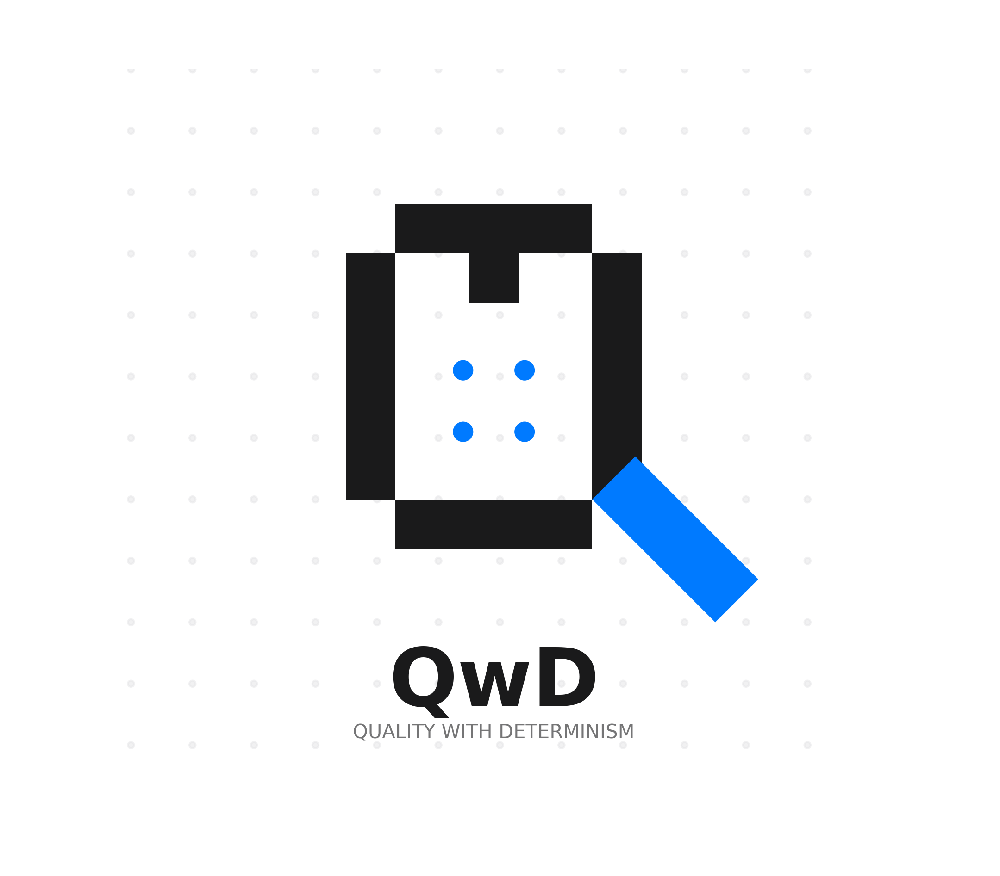

# QwD (قَلَّ وَدَلَّ)


QwD is a highly advanced SIMD-vectorized streaming Sequence Analytics Engine. 

### Meaning
QwD derives from Arabic:
**قَلَّ وَدَلَّ (qalla wa dalla)**
Meaning: **brevity with clarity**

---

### Project Status (v1.1.0-stable)
QwD v1.1.0 marks the transition to a production-grade suite. It introduces the **Ordered Parallel BGZF Engine**, breaking the single-threaded Gzip bottleneck and achieving processing speeds of **>5.8 Million reads per second**. This version also debuts the **QwD Dashboard**, a native macOS application for real-time visual diagnostics.

### Key Features
- **Ordered Parallel BGZF Engine**: A custom producer-worker-consumer architecture that parallelizes BGZF decompression while guaranteeing **100% record accuracy** across block boundaries.
- **Vertical SIMD & Bitplane Core**: Converts genomics data into parallel bit-matrices, reducing analytical complexity to **O(N/64)** using hardware popcount.
- **Universal GZIP Probing**: Automatically detects BGZF vs. Standard GZ and selects the optimal path (Parallel vs. Fast-Sequential) without user intervention.
- **Dual-Mode Precision**: 
    - **EXACT**: 100% bit-identical results for publication-grade science.
    - **APPROX (`--fast`)**: Probabilistic sketching (MinHash/Bloom Filters) for terabyte-scale runs with O(1) memory.
- **Multi-Language Ecosystem**: Native-speed bindings for Python and R, and a professional SwiftUI Dashboard.

---

### Performance (1M Reads Peak Single-Core)
| Format | Engine | Throughput | vs Plain |
| :--- | :--- | :--- | :--- |
| **BGZF GZIP** | **libdeflate (SIMD)** | **~5,830,000 reads/sec** | **1.04x** |
| **BGZF GZIP** | **QwD Native (Zig)** | **~5,290,000 reads/sec** | **0.94x** |
| Plain FASTQ | Direct I/O | ~5,590,000 reads/sec | 1.00x |
| Standard GZIP | Compat Fallback | ~3,110,000 reads/sec | 0.55x |

*Note: QwD overlaps decompression with analysis, making compressed processing effectively "free" relative to raw I/O.*

---

### Installation & Build
```bash
/usr/local/zig/zig build -Doptimize=ReleaseFast
```

### Quick Start
- **CLI**: `qwd qc reads.fastq.gz --threads 8`
- **Python**: `import qwd; metrics = qwd.qc("reads.fastq.gz", threads=8)`
- **R**: `library(qwd); res <- qwd_qc("reads.fastq.gz", threads=8)`

---

### Documentation
- **[Phase P: Universal GZIP Engine](docs/phase_p.md)**
- **[CLI Usage Guide](docs/cli_usage.md)**
- **[Architecture Deep Dive](docs/native_qwd_engine.md)**
- **[Dashboard Setup](apps/dashboard/README.md)**

### License
Academic Free License (AFL) 3.0

### Author
MD. Arshad (arshad10867c@gmail.com)
